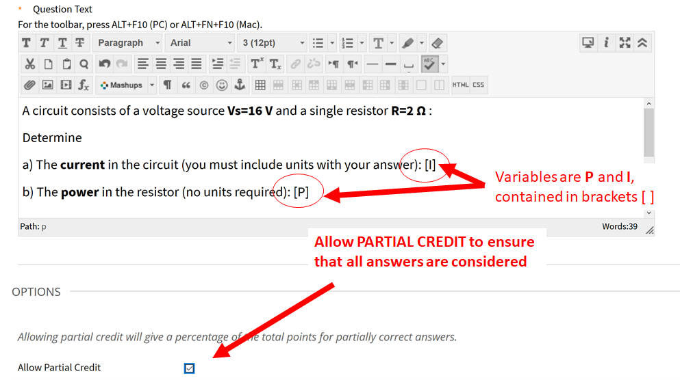
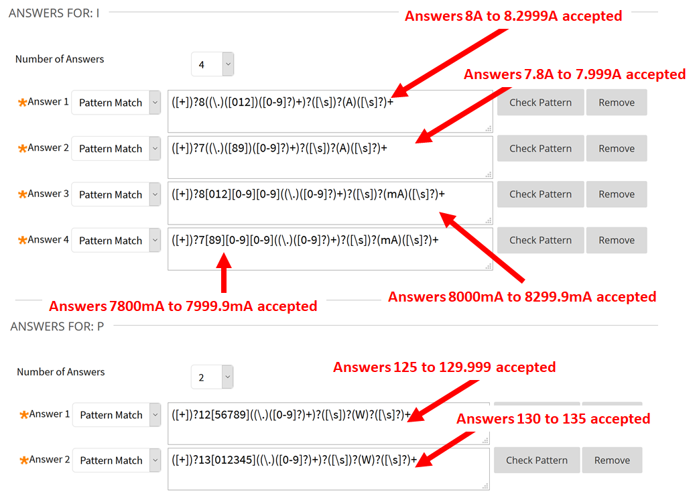
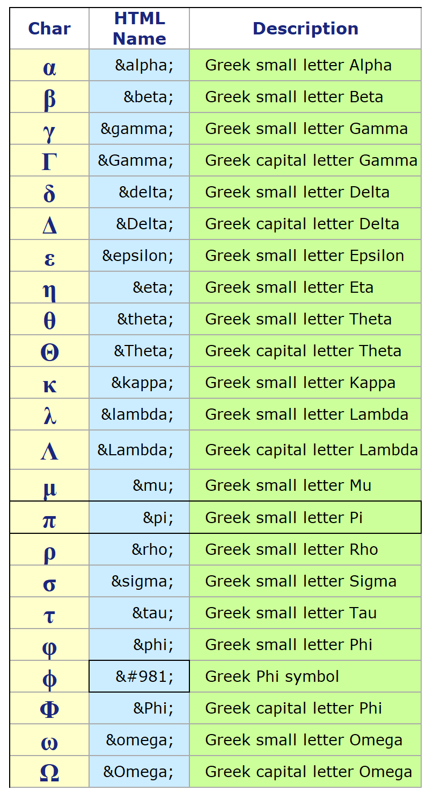
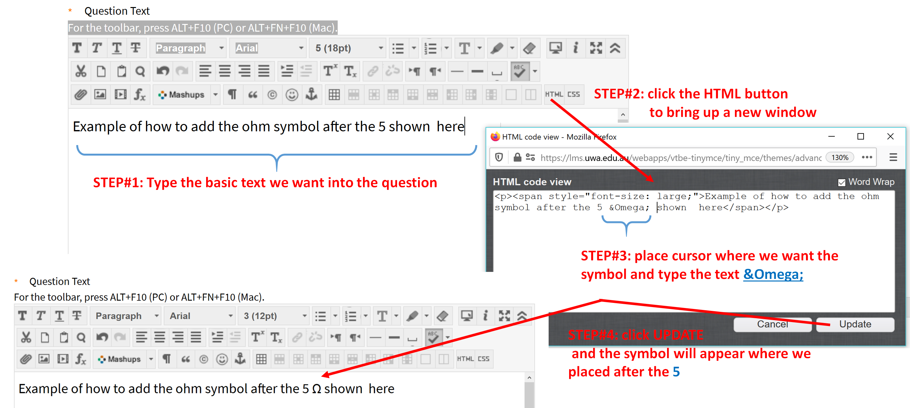

# BlackBoard-Multipart-Questions
 Often in engineering and science based units, there is a need for students to demonstrate proficiency at completing detailed, multi-part questions.  This github describes how Blackboard's "Fill in Multiple Blanks Question" type questions can be used for just such a question.
 
 ## Creating the basic 
 Blackboard Help provides the [basics for creating <b>Fill in Multiple Blanks Questions </b>](https://help.blackboard.com/Learn/Instructor/Tests_Pools_Surveys/Question_Types/Fill_in_Multiple_Blanks_Questions).  The key here is in understanding how to set up the answers to use Pattern Match which uses a [regular expression](https://www.rexegg.com/regex-quickstart.html) to evaluate an entered value. There are some very useful sites that allow you to experiment with the [evaluation of regular expressions](https://regex101.com/).  Without pattern matching, the Answers are matches to the string data that the student enters so any Answer you provide must match <b>exactly</b> or <b>contain</b> a sub-string of the student-entered data.  There is little flexibility here.  However using <b>pattern matching</b>, the solutions can be interpreted as numerical data and variations are allowed including leading zeros (0.X), different exponent forms (E,e) and differing number of decimal palces (3.1 verses 3.14156) - all the different forms can all be accepted as correct.  <b>IMPORTANTLY, it is possible to check for the inclusion of units or to ignore units if desired as I will show later.</b>
 
 Some pattern matching I have used and find usefull are:
 |Regular expression |Matches|
 |----|-------|
| 3.7([0-9]?)+([E,e])([+])?3 | 3.7e3, 3.71223e3,3.7e+3,3.7332E3,3.7e3 |   
| 3714(\.)?([0-9]?)+ | 3714,3714.122,,3714.,,3714.000 |  
|[0]?.0024([0-9]?)+ | .0024,0.0024,0.0024566|
|-2.4([0-9]?)+([E,e])-(0)?5|-2.4e-5,-2.46565e-5,-2.46565e-05,-2.46565E-5|
|([+])?8((\.)([012])([0-9]?)+)?([\s])?(V\^2)?|8.156,8,8.0V^2,8.0 V^2,+8.0 V^2 (basically 8 up tp 8.2 with or without units)|

Pattern matching is particularly usefull for adding a range to your answers as indicated in the table.  However if the number is say 8 and can be +/-0.2 then then last solution in the table would cover 8->8.2, but would not capture the 7.8-8 range of values.  However multiple answers are allowed for [<b>Fill in Multiple Blanks </b>](https://help.blackboard.com/Learn/Instructor/Tests_Pools_Surveys/Question_Types/Fill_in_Multiple_Blanks_Questions) type questions, and hence this can be covered as shown in the Figure below.

Consider the Question entered below.  Note I have used two variables [I] and [P] to represent the current and power, respectively.  Ensure that you select the partial marks button before going on to the next screen, otherwise, if the student gets the <b>current</b> wrong, then <b>power</b>-answer will automatically be marked wrong. 

 <figcaption > <I><b>Figure 1: </b></I>Screenshot for the question and setup required for the Fill in Multiple Blanks Question.</figcaption >  

At the next screen I show the various pattern matching forms I have used for the question.  In this example, the pattern matching allows for a range of ranges 7.8->8.2.99 and <b> MUST </b> include units of either A or mA to be marked as correct.  The same is not true for the power answer where I do not require units to be entered.

<b> Importantly, note</b> that each of the questions being asked is sharing the same question dataset (the voltage and the current) so that complex, multi-part questions can be asked based on a single system, figure or plot.   

 

<figcaption > <I><b>Figure 1: </b></I> Screenshot fo the patterns entered to allow evaluation of both current and power within a single question. </figcaption >
  

## Useful HTML codes
 The table below shows some very useful codes that can be used when making Engineering/Science based questions.  Just switch into HTML mode, enter the code starting with <b>&</b> ending with <b>;</b> and the displayed page will show well formated (inline) Greek-symbols.  This displays much better than inserting the same Greek-symbol using the equation editor.   
 
 
 
 

 

<figcaption > <I><b>Figure 3: </b></I>Table of HTML Codes useful for Engineering/Science type questions. </figcaption >  

 
### The process in detail:

To insert a symbol, use the process shown below.  In the text field of your question, <b>STEP 1:</b> Insert your text, then <b>STEP 2:</b> click the HTML button which brings up a HTML editor.  <b>STEP 3: </b> place your cursor whereever you want the symbol and type the code listed in the table above (in this case I want an &Omega; symbol so I enter <b>\&Omega;</b> then complete the editing by <b>STEP 4:</b> clicking the UPDATE button.  The desired symbol should now be entered in your question.  If you need more of this type of symbol in the question, you don't need to repeat the process - just use cut-and-paste (ctrl-C then ctrl-V)   

  

<figcaption > <I><b>Figure 4: </b></I>Table of Illustration of how to insert Greek-Symbols into LMS based quiz questions. </figcaption >  