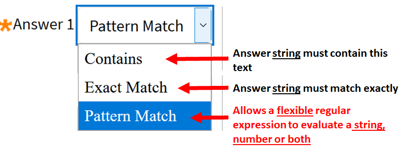

# BlackBoard-Multipart-Questions
 Often in engineering and science based units, there is a need for students to demonstrate proficiency at completing detailed, multi-part questions.  This github describes how Blackboard's "Fill in Multiple Blanks Question" type questions can be used for just such a question.
 
 ## Creating the basic 
 Blackboard Help provides the [basics for creating <b>Fill in Multiple Blanks Questions </b>](https://help.blackboard.com/Learn/Instructor/Tests_Pools_Surveys/Question_Types/Fill_in_Multiple_Blanks_Questions).  The key here is in understanding how to set up the answers to use Pattern Match which uses a [regular expression](https://www.rexegg.com/regex-quickstart.html) to evaluate an entered value. There are some very useful sites that allow you to experiment with the [evaluation of regular expressions](https://regex101.com/).  There are several other options provided in the pull down menu when entering the answers on a Blackboard  as indicated in the image right.
 
 These include <b>Exact Match</b> which will match only the defined text string, <b>Contains</b> which will search the string text entered by the student for the sub-string given as the answer, and finally <b>Pattern Match</b>.  Only <b>Pattern Match</b> will allow the student's response to be a string, number (float or integer), or both a number and string (which might be used for a number containing a unit).  It could also allow a response to be entered as a vector (3x+5y) and evaluated correctly.  This makes the use of  <b>Pattern Match</b> extremely powerfull in engineering ans schience based questions.  <b>So what's the catch ? </b> Well:
 1) using  <b>Pattern Match</b> requires an understanding of regular expressions.  If you're a programmer you may be used to these before and hence setting up such a answer on Blackboard is easy.  If you  do not use [regular expression](https://www.rexegg.com/regex-quickstart.html) in your day-to-day life, there is some learning to be done.  However I encourage you to draw on support from local computer programmers within the institution (students and/or staff), see my cheat sheet below and/or check out the may tools online to help
 2) the other down-side is that when displaying the answers to the problem, students are not presented with a clear response like "the answer was 8.0".  Instead, the view they get might show a answer like <code> ([+])?8((\.)([012])([0-9]?)+)?([\s])?(V\^2)?</code>.  Some students can figure it out, some will need some guidance, and others will just need to contact you for the answer.  I argue that this encourages another form of learning (research) by the student, and any student who engages with the teacher for more information is taking a proactive apporach to their studies.  
 
 So restating the above, without using pattern matching, the answers provided by the student are matches to the string data that the student enters so any answer you provide must match <b>exactly</b> or <b>contain</b> a sub-string of the student-entered data.  There is little flexibility here.  However using <b>pattern matching</b>, the solutions can be interpreted as numerical data and variations are allowed including leading zeros (0.81), different exponent forms (E,e) and differing number of decimal palces (3.1 verses 3.14156) - all the different forms can be accepted as correct.  <b>IMPORTANTLY, it is possible to check for the inclusion of units or to ignore units if desired as I will show later.</b>
 
 Some pattern matching I have used and find usefull are:
 |Regular expression |Matches|
 |----|-------|
| 3.7([0-9]?)+([E,e])([+])?3 | 3.7e3, 3.71223e3,3.7e+3,3.7332E3,3.7e3 |   
| 3714(\.)?([0-9]?)+ | 3714,3714.122,,3714.,,3714.000 |  
|[0]?.0024([0-9]?)+ | .0024,0.0024,0.0024566|
|-2.4([0-9]?)+([E,e])-(0)?5|-2.4e-5,-2.46565e-5,-2.46565e-05,-2.46565E-5|
|([+])?8((\.)([012])([0-9]?)+)?([\s])?(V\^2)?|8.156,8,8.0V^2,8.0 V^2,+8.0 V^2 (basically 8 up tp 8.2 with or without units)|

Some of these look daunting, but lets break them down a little to look at what each sub-section of the Regular expression  does: 
* <code> ([0-9]?)+)</code> <b>[Interpretation]:</b> The sub-string allows any combination of numbers 0 thru 9 to be entered, so it allows 3,33,333,3333,3333 etc..  This is useful where students enter too many decimal places in an answer. Effectively it tell the system to ignore these digits   
* <code> ([\s])?</code> <b>[Interpretation]:</b>  some students will enter a space before units, some will not.  some will put a space after the last digit, some will not.  This setting simply tells the system to ignore any white-spaces in these locations 
* <code> (\\.) </code> <b>[Interpretation]:</b> the decimal point is a special character in a  regular expression, so to properly match a decimal point in the answer, make sure to proceed with a <b>\\</b>  
* <code>([+])?</code> <b>[Interpretation]:</b>  some students may enter a + at the start of their answer, and this just tells the system to ignore this if entered.
* <code> +([E,e])</code> <b>[Interpretation]:</b>  allows an answer in exponent for with a positive exponent using either capital or lower case for the exponent. 
* <code> 8((\.)([012])</code>: <b>[Interpretation]:</b>  <b>This is the really important bit, the answer !!</code>.  Entering any plan numbers or letters tells the system to match to these.  the use of numbers in brackets [012] tells the systems that the next number can be a 0, 1 or 2.  so thsi allows answers of 8.0, 8.1 or 8.2, effectively matching the solution a range rom 8.0-8.2 

Armed with the above, you can just cut-and-paste these various forms into your answer to construct a robust solution that catches as many correct answers as possible.  What is nice about the [<b>Fill in Multiple Blanks</b>](https://help.blackboard.com/Learn/Instructor/Tests_Pools_Surveys/Question_Types/Fill_in_Multiple_Blanks_Questions) answer format is that it allows up to 20 DIFFERENT potential answers (and hence up to 20 diferrent patterns to match).  If a student emails you indicating they did not get graded correctly, you can look at their response and if it needs a new pattern match statement, simple create another one and add it to the list of patterns that will match (see Figure 4 below).  This will then automatically be regraded for all students and next year the same problem will not occur.  I have found after about 2 years of updating answers, I no longer have complaints from students over the answers that they entered.

Pattern matching is particularly usefull for adding a range to your answers as indicated in the table above.  However if the number is say 8 and can be +0.2999 or -0.2 around that answer (I deliberately chose an asymetrical uncertainty range), then the last solution in the table would cover 8->8.2999, but would not capture the 7.7-8 range of values.  However since multiple answers are allowed for [<b>Fill in Multiple Blanks </b>](https://help.blackboard.com/Learn/Instructor/Tests_Pools_Surveys/Question_Types/Fill_in_Multiple_Blanks_Questions) this case can be covered by entering a second possible answer.  This is illustrated in more detail through the example below.

## Example
Consider the Question entered below.  Note I have used two variables [I] and [P] to represent the current and power, respectively.  Ensure that you select the partial marks button before going on to the next screen, otherwise, if the student gets the <b>current</b> wrong, then <b>power</b>-answer will automatically be marked wrong. 

 <figcaption > <I><b>Figure 1: </b></I>Screenshot for the question and setup required for the Fill in Multiple Blanks Question.</figcaption >  

At the next screen I show the various pattern matching forms I have used for the question.  In this example, the pattern matching allows for a range of ranges 7.8->8.2.99 and <b> MUST </b> include units of either A or mA to be marked as correct.  The same is not true for the power answer where I do not require units to be entered.

<b> Importantly, note</b> that each of the questions being asked is sharing the same question dataset (the voltage and the current) so that complex, multi-part questions can be asked based on a single system, figure or plot.   

 

<figcaption > <I><b>Figure 2: </b></I> Screenshot fo the patterns entered to allow evaluation of both current and power within a single question. </figcaption >
  

## Useful HTML codes
 The table below shows some very useful codes that can be used when making Engineering/Science based questions.  Just switch into HTML mode, enter the code starting with <b>&</b> ending with <b>;</b> and the displayed page will show well formated (inline) Greek-symbols.  This displays much better than inserting the same Greek-symbol using the equation editor.   
 
 
 
 

 

<figcaption > <I><b>Figure 3: </b></I>Table of HTML Codes useful for Engineering/Science type questions. </figcaption >  

 
### The process in detail:

To insert a symbol, use the process shown below.  In the text field of your question, <b>STEP 1:</b> Insert your text, then <b>STEP 2:</b> click the HTML button which brings up a HTML editor.  <b>STEP 3: </b> place your cursor whereever you want the symbol and type the code listed in the table above (in this case I want an &Omega; symbol so I enter <b>\&Omega;</b> then complete the editing by <b>STEP 4:</b> clicking the UPDATE button.  The desired symbol should now be entered in your question.  If you need more of this type of symbol in the question, you don't need to repeat the process - just use cut-and-paste (ctrl-C then ctrl-V)   

  

<figcaption > <I><b>Figure 4: </b></I>Table of Illustration of how to insert Greek-Symbols into LMS based quiz questions. </figcaption >  